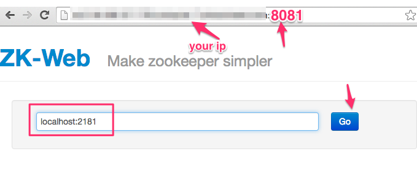
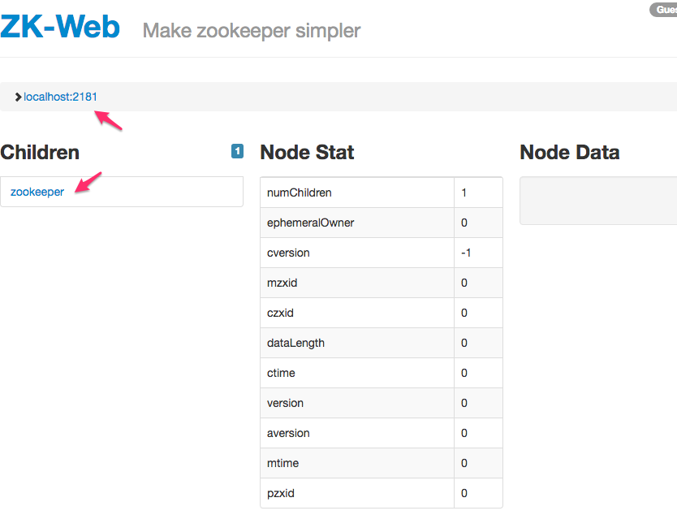
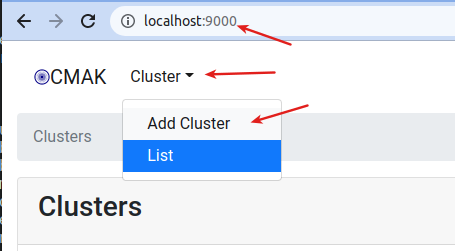

<link rel='stylesheet' href='../assets/css/main.css'/>

[<< back to main index](../README.md)

# Lab 1.2 : Setup UI Clients

### Overview

Setup UI Clients for Kafka and Zookeeper

### Depends On

None

### Run time

15 mins

## Step 1 - Using ZKWeb UI

zk-web can be accessed via port 9001.  
Go to http://your_ip_address:9001 in a browser.  Substitute your own machine IP.

You would see an output like this:

## Step 2 - Accessing Kafka Manager UI

Here we will setup [Kafka Manager](https://github.com/yahoo/CMAK)

Go to url :  http://your_IP:9000  in your browser.

You may see a  UI like this.

Access  the 'local' cluster already defined.  If one is not defined, you can define one as follows.

Explore  the UI

