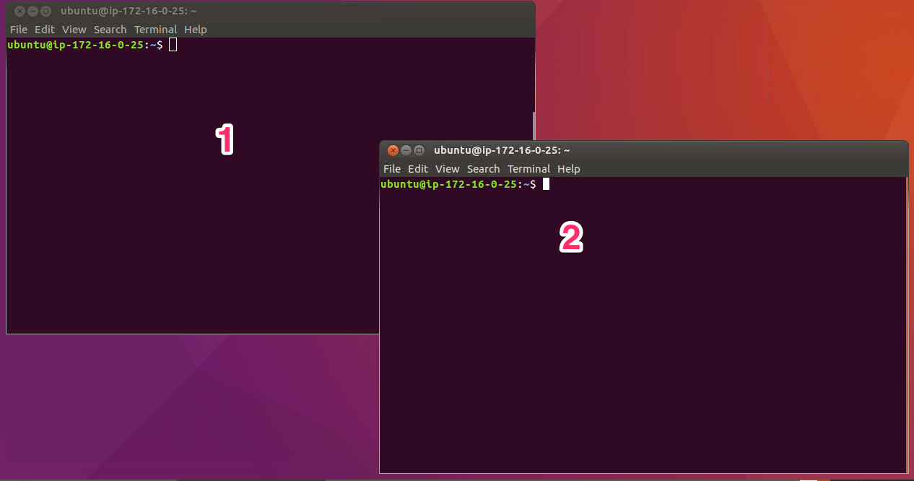
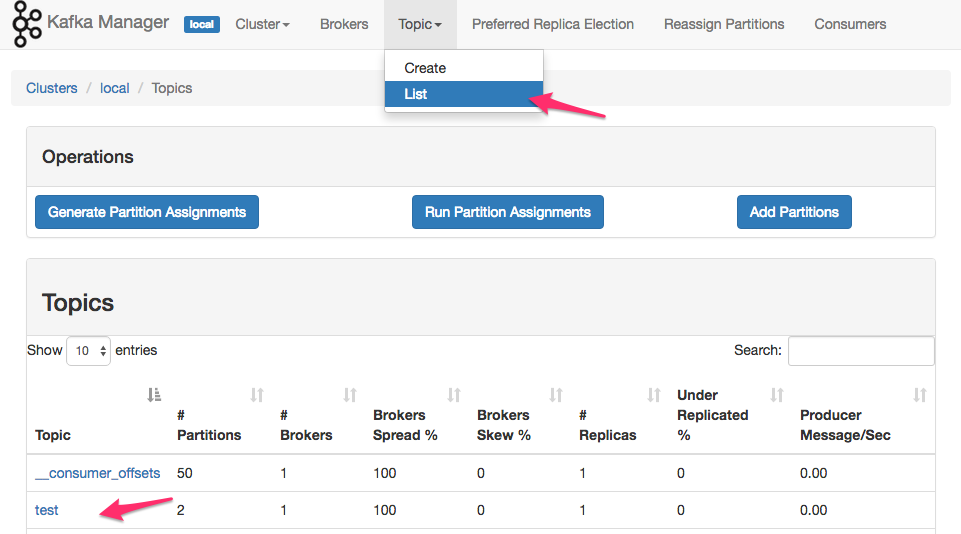
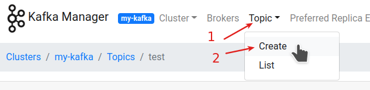
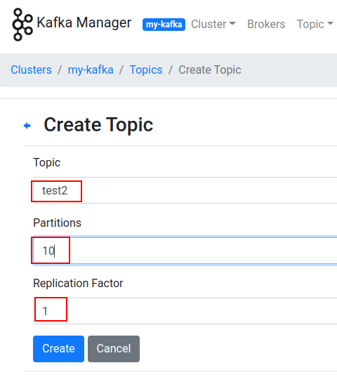
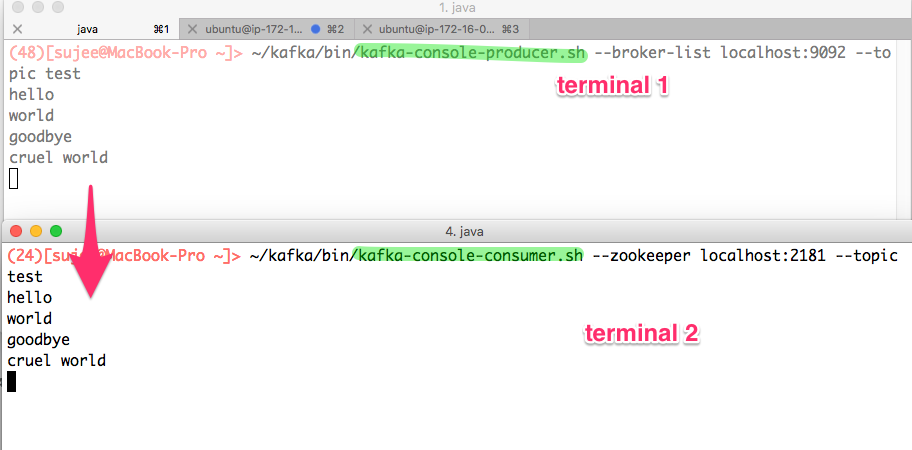

<link rel='stylesheet' href='../assets/css/main.css'/>

[<< back to main index](../README.md)

# Lab 2.1 : Kafka Command Line Utilities

## Overview

Use Kafka Command line utils

## Depends On

None

## Run time

10 mins

## Quick Note: `--bootstrap-server`  or `--zookeeper`

The older version of Kafka commands used `-zookeeper` flag.

For example:

```bash
$   ~/apps/kafka/bin/kafka-topics.sh \
        --zookeeper localhost:2181 --list
```

In newer clients, `--zookeeper` flag is being replaced by `--bootstrap-server` option

```bash
$   ~/apps/kafka/bin/kafka-topics.sh \
        --bootstrap-server localhost:9092 --list
```

So going forward please use `--bootstrap-server` option

## Step 1 : Open two terminals to your Kafka node



- Option 1 : Use Jupyter Labs and open two terminals ( File --> New --> Terminal)  
 You can drag the terminal tab to order them

- Option 2 : Open multiple SSH terminals using Putty or equivalent

## Step 2 : Create Topics

Inspect current topics

```bash
$   ~/apps/kafka/bin/kafka-topics.sh \
        --bootstrap-server localhost:9092 --list
```

Let's create a `test` topic

```bash
$   ~/apps/kafka/bin/kafka-topics.sh  --bootstrap-server localhost:9092   \
       --create --topic test --replication-factor 1  --partitions 2
```

Verify:

```bash
$   ~/apps/kafka/bin/kafka-topics.sh \
        --bootstrap-server localhost:9092  --list
```

Describe the topic

```bash
$   ~/apps/kafka/bin/kafka-topics.sh --bootstrap-server localhost:9092  \
        --describe --topic test
```

## Step 3 : Inspect Kafka Manager UI



## Step 4: Create a Topic from Kafka Manager

Create a new topic `test2` with 10 partitions from KM

See screenshots below






## Step 5 : Let's send some messages

On terminal-1  start `kafka-console-producer`

```bash
$    ~/apps/kafka/bin/kafka-console-producer.sh \
        --bootstrap-server localhost:9092 --topic test
```

On terminal-2 start `kafka-console-consumer`

```bash
$   ~/apps/kafka/bin/kafka-console-consumer.sh \
        --bootstrap-server localhost:9092 --topic test
```

**==> In producer terminal (1) type some data**  

**==> Watch the output on consumer terminal (2)**

Click on the image to see larger version.
<a href="../assets/images/2c.png"></a>


## Step 6 : Try these

**Stop the consumer using `Ctrl+c`.**

**==> Start consumer with `from-beginning` flag**

```bash
$    ~/apps/kafka/bin/kafka-console-consumer.sh \
    --bootstrap-server localhost:9092 --topic test --from-beginning
```

**=> Is the consumer reading the data 'in-order' as we typed in producer terminal?  Why or why not?**  


## Step 7: Find out options for console-producer and console-consumer

Invoke `console-producer` and `console-consumer` without any arguments to find out all the options.

```bash
$    ~/apps/kafka/bin/kafka-console-producer.sh

$    ~/apps/kafka/bin/kafka-console-consumer.sh
```

## Step-8: Read From a Particular Offset

Try this:

You need to specify `topic`, `partition` and `offset`

```bash
$   ~/apps/kafka/bin/kafka-console-consumer.sh --bootstrap-server localhost:9092 \
    --topic test --partition 1  --offset 2 
```

Play around with different parameters
