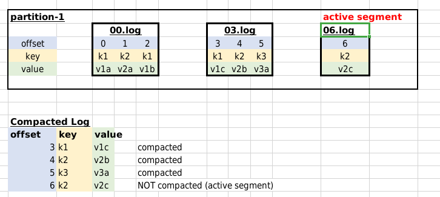

<link rel='stylesheet' href='../assets/css/main.css'/>

[<< back to main index](../README.md)

# Lab 2.4: Using Compacted Topics

### Overview

Use Kafka Command line utils

### Depends On

### Run time

10 mins

## Step-1: Create a Compacted Topic

```bash
$  ~/apps/kafka/bin/kafka-topics.sh --bootstrap-server localhost:9092 \
 --create --topic compact1 \
 --replication-factor 1 --partitions 2 \
 --config "cleanup.policy=compact" \
 --config "delete.retention.ms=1000" \
 --config "segment.ms=1000" \
 --config "max.compaction.lag.ms=1000"
```

Configuration explained:

* **cleanup.policy** : The default cleanup policy for segments beyond the retention window.  Valid policies are: "delete" and "compact".  [More details here](https://kafka.apache.org/documentation/#topicconfigs_cleanup.policy)
* **delete.retention.ms**: The amount of time to retain delete tombstone markers for log compacted topics.  Default 86400000 (1 day).  [More details here](https://kafka.apache.org/documentation/#topicconfigs_delete.retention.ms)
* **segment.ms**: This configuration controls the period of time after which Kafka will force the log to roll.  Default 604800000 (7 days). [More details here](https://kafka.apache.org/documentation/#topicconfigs_segment.ms)
* **min.cleanable.dirty.ratio**:  This configuration controls how frequently the log compactor will attempt to clean the log. Default is 0.5 (50%).  [More details here](https://kafka.apache.org/documentation/#topicconfigs_min.cleanable.dirty.ratio)
* **min.compaction.lag.ms**: the minimal time that has to pass before the message can be compacted. That is one of the reasons why we cannot expect to see only the most recent version of the message in the topic. [More details here](https://kafka.apache.org/documentation/#topicconfigs_min.compaction.lag.ms)
* **max.compaction.lag.ms**: the maximum delay between the time a message is written and the time the message becomes eligible for compaction. This configuration parameter overwrites min.cleanable.dirty.ratio and forces a log segment to become compactable even if the “dirty ratio” is lower than the threshold.  Default value is 9223372036854775808 (292,471,208.677 years!).  [More details here](https://kafka.apache.org/documentation/#topicconfigs_max.compaction.lag.ms)

For more detailed explanation see [Kafka documentation](https://kafka.apache.org/documentation/)

## Step-2: Inspect Created Topic

```bash
$   ~/apps/kafka/bin/kafka-topics.sh --bootstrap-server localhost:9092  \
        --describe --topic compact1
```

You will see output as follows

```console
Topic: compact1 PartitionCount: 2       ReplicationFactor: 1    Configs: cleanup.policy=compact,segment.bytes=1073741824,max.compaction.lag.ms=1000,delete.retention.ms=100,segment.ms=100

        Topic: compact1 Partition: 0    Leader: 0       Replicas: 0     Isr: 0
        Topic: compact1 Partition: 1    Leader: 0       Replicas: 0     Isr: 0
```

## Step-3: Send Some Data

Start console producer and send some data

Using `Kafkacat`

```bash
$   kafkacat -P -b localhost:9092 -t compact1 -K :
```

or using `console-producer`

```bash
$   ~/apps/kafka/bin/kafka-console-producer.sh --bootstrap-server localhost:9092 \
        --property parse.key=true --property key.separator=:  \
        --topic compact1
```

Type some sample data in this format.  We are using `:` as key-value seperator.

```console
k1:v1a
k2:v2a
k1:v1b
k1:v1c
k2:v2b
k3:v3a
k2:v2c
```

Note: To end the input data stream you can type `Ctrl + d` on this terminal.

## Step-4: Read Data

Open another terminal.

Run a consumer using `kafkacat`

```bash
$   kafkacat -q -C -b localhost:9092 -t compact1 -f 'Partition %t[%p], offset: %o, key: %k, value: %s\n'
```

or using `console consumer` and read from beginning.

```bash
$   ~/apps/kafka/bin/kafka-console-consumer.sh --bootstrap-server localhost:9092 --property  print.key=true --property key.separator=: --from-beginning  --topic compact1
```

You might see output like this:

```console
k1:v1c
k2:v2b
k3:v3a
k2:v2c
```

### Note:

If you don't see the compacted results, paste the data again in the producer and restart the consumer.

## Step-5: Discuss the Results

As we can see, not all keys are compacted?  Why is that?

Kafka broker divides the partition log into segments.  Segments are files stored in the file system (inside data directory and in the directory of the partition), which their name ends with `.log`

The last segment in the partition is called the **active segment**. Only the active segment of a log can receive the newly produced messages.

Kafka will not compact keys in **active segment**



You can see partition logs like this

```bash
$   tree  /tmp/kafka-logs/compact1-*
```

```console
/tmp/kafka-logs/compact1-0
├── 00000000000000000000.index
├── 00000000000000000000.log
├── 00000000000000000000.timeindex
└── leader-epoch-checkpoint
/tmp/kafka-logs/compact1-1
├── 00000000000000000000.index
├── 00000000000000000000.log
├── 00000000000000000000.timeindex
├── 00000000000000000006.snapshot
├── 00000000000000000007.index
├── 00000000000000000007.log
├── 00000000000000000007.snapshot
├── 00000000000000000007.timeindex
└── leader-epoch-checkpoint
```

```bash
#   /tmp/kafka-logs/TOPIC_NAME-PARTITION

$   ls -ltr /tmp/kafka-logs/compact1-1/
```

```console
-rw-r--r-- 1 ubuntu ubuntu        8 Jan 18 22:55 leader-epoch-checkpoint
-rw-r--r-- 1 ubuntu ubuntu       10 Jan 18 23:07 00000000000000000006.snapshot
-rw-r--r-- 1 ubuntu ubuntu       10 Jan 18 23:07 00000000000000000007.snapshot
-rw-r--r-- 1 ubuntu ubuntu       10 Jan 18 23:59 00000000000000000008.snapshot
-rw-r--r-- 1 ubuntu ubuntu       10 Jan 19 00:07 00000000000000000009.snapshot
-rw-r--r-- 1 ubuntu ubuntu       10 Jan 19 00:07 00000000000000000010.snapshot
-rw-r--r-- 1 ubuntu ubuntu       12 Jan 19 00:18 00000000000000000000.timeindex
-rw-r--r-- 1 ubuntu ubuntu      147 Jan 19 00:18 00000000000000000000.log
-rw-r--r-- 1 ubuntu ubuntu        0 Jan 19 00:18 00000000000000000000.index
-rw-r--r-- 1 ubuntu ubuntu       10 Jan 19 00:18 00000000000000000011.snapshot
-rw-r--r-- 1 ubuntu ubuntu 10485756 Jan 19 00:18 00000000000000000012.timeindex
-rw-r--r-- 1 ubuntu ubuntu       10 Jan 19 00:18 00000000000000000012.snapshot
-rw-r--r-- 1 ubuntu ubuntu       74 Jan 19 00:18 00000000000000000012.log
-rw-r--r-- 1 ubuntu ubuntu 10485760 Jan 19 00:18 00000000000000000012.index
```

## References

* [Log compaction in Kafka](https://towardsdatascience.com/log-compacted-topics-in-apache-kafka-b1aa1e4665a7)
* [What is kafka log compaction how does it work](https://www.mikulskibartosz.name/what-is-kafka-log-compaction-how-does-it-work/)

