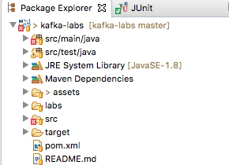

<link rel='stylesheet' href='../assets/css/main.css'/>

[<< back to main index](../README.md)

# Lab 3.1 : Import Kafka Project

### Overview
Import the 'kafka-labs' project into your favorite IDE.

### Depends On
None

### Run time
10 mins

## STEP 0: To Instructor
Walk through this project on screen first.

## STEP 1: Login to the VM via SSH
Instructor will provide details.

## Step 2: Get 'kafka-labs' project
From terminal, execute the following

```bash
    # make sure we do this in ~/dev dir
    $   cd  $HOME/dev

    # Instructor will provide the URL
    $   wget <LAB URL>

    $   unzip  kafka-labs.zip
```

## STEP 3: Login to the VM via VNC
Instructor will provide details.

## STEP 4: Open 'kafka-labs' Project In Eclipse
This is a maven project.  And can be readily opened by Eclipse or IntelliJ.

* Right click on 'Projects' view
* Select 'Import'
* Select 'Existing Maven Projects'
* Navigate to 'kafka-labs' directory and select the directory




<br clear="all"/>

## STEP 5: Inspect 'ClickstreamGenerator'
Inspect file : `src/main/java/x/utils/ClickStreamGenerator.java`  
This file generates random clickstream data that we will use.

**=> Right-click on `ClickStreamGenerator.java`  file and run it.**

Here is a sample output:

```console

1451635200005,ip_67,user_16,clicked,facebook.com,campaign_5,91,session_251
1451635200010,ip_57,user_89,viewed,foxnews.com,campaign_4,17,session_224
...

{"timestamp":1451635200055,"session":"session_57","domain":"twitter.com","cost":24,"user":"user_31","campaign":"campaign_1","ip":"ip_64","action":"blocked"}
{"timestamp":1451635200060,"session":"session_188","domain":"foxnews.com","cost":26,"user":"user_33","campaign":"campaign_4","ip":"ip_99","action":"clicked"}
```

## Done 👏

Great.. now your environment is setup!
