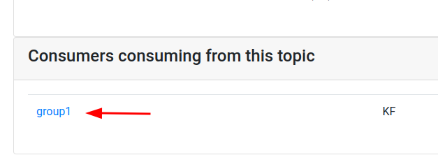
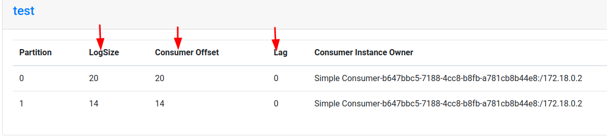

<link rel='stylesheet' href='../assets/css/main.css'/>

[<< back to main index](../README.md)

# Lab 3.2 : Simple Producer / Consumer

## Instructor

**Please demo this example, and do the lab together with students, step by step**

## Overview

Run simple Producer / Consumer

## Depends On

None

## Run time

30 mins

## Step 1 : Create `test` topic

IF you haven't done before, let's create a `test` topic

```bash
$   ~/apps/kafka/bin/kafka-topics.sh  --bootstrap-server localhost:9092   \
       --create --topic test --replication-factor 1  --partitions 2
```

## Step 2 : Run a console consumer

In a terminal

```bash
$  ~/apps/kafka/bin/kafka-console-consumer.sh \
        --bootstrap-server localhost:9092 \
        --property print.key=true --property key.separator=":" \
        --topic test
```

or if you have Kafkacat

```bash
$   kafkacat -q -C -b localhost:9092 -t test -f 'Partition %t[%p], offset: %o, key: %k, value: %s\n'
```

## Step 3 : Simple Producer

* Inspect file : `src/main/java/x/lab03_api_intro/SimpleProducer.java`.  
* Run the Producer
In Eclipse,
    - Right click on 'src/main/java/x/lab03_api_intro/SimpleProducer.java'
    - Run as 'Java Application'

In Eclipse console, you should see output as follows:
```console
sending : ProducerRecord(topic=test, partition=null, key=1, value=Hello world, timestamp=null)
```


## Step 4 : Monitor Kafka console consumer

The messages should show up in Kafka console terminal !  
Yay !!


## Step 5 : Consumer

* Inspect file `src/main/java/x/lab03_api_intro/SimpleConsumer.java`  
* Run the Consumer
In Eclipse,
    - Right click on 'src/main/java/x/lab03_api_intro/SimpleProducer.java'
    - Run as 'Java Application'

This will keep running.

## Step 6 : Run the Producer again

* Right click on `src/main/java/x/lab03_api_intro/SimpleProducer.java`
* Run as 'Java Application'

**=> In Eclipse, monitor output from two of these programs**   
Hint : you may need to switch to Debug view

**=> Also what is happening in Kafka console consumer?**

## Step 7: Run Two Consumers

Stop the running consumer first (in Eclipse)

Leave console consumer running.

Run two instances of the `Simple Consumer` (from Eclipse)

Also run `SimpleProducer` from Eclipse.

How many messages each consumer get?  Can you explain? :smile:

## Step 8: Inspect Kafka Manager

Look at partition based consumption for `test` topic from Kafka manager.  See screenshots below

**Instructor, please explain the stats**





## Step 9: Run Three Consumers

Stop the running consumers first (in Eclipse)

Leave console consumer running.

Run three instances of the `Simple Consumer` (from Eclipse)

Also run `SimpleProducer` from Eclipse.

How many messages each consumer get?  Can you explain? :smile:

