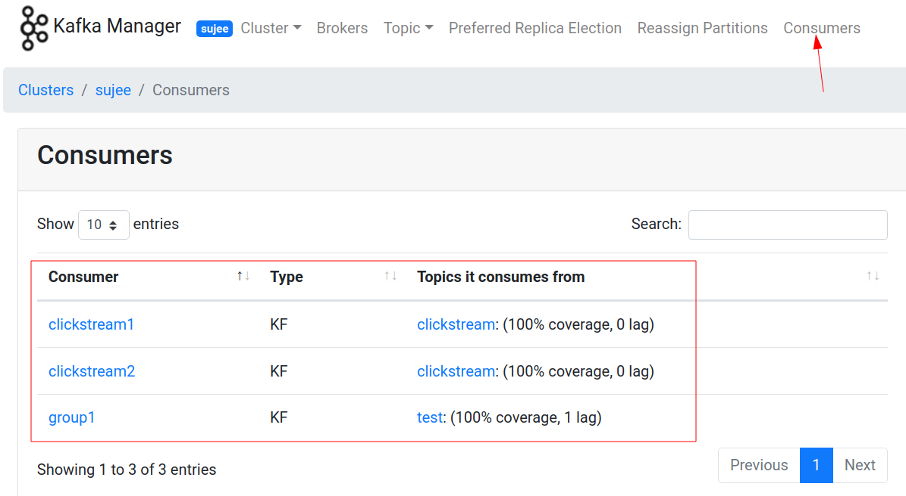
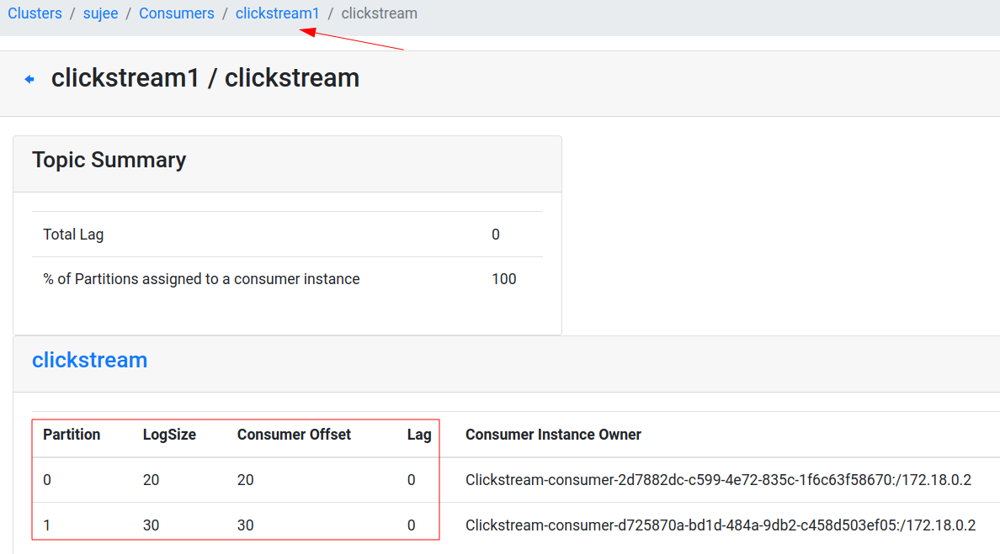

<link rel='stylesheet' href='../assets/css/main.css'/>

[<< back to main index](../README.md)

# Lab 3.3 : Working With Kafka API

## Instructor

**Please do the lab together with students, step by step**

## Overview

Use Producer / Consumer API

## Depends On

None

## Run time

40 mins

## Step 1 : Create a 'clickstream' topic

```bash
    $   ~/apps/kafka/bin/kafka-topics.sh  --bootstrap-server localhost:9092  --create \
        --topic clickstream --replication-factor 1  --partitions 2
```

## Step 2 : Open a console consumer

In a terminal
```
    $  ~/apps/kafka/bin/kafka-console-consumer.sh \
        --bootstrap-server localhost:9092 \
        --property print.key=true --property key.separator=":" \
        --topic clickstream
```

or if you have Kafkacat

```bash
$   kafkacat -q -C -b localhost:9092 -t clickstream -f 'Partition %t[%p], offset: %o, key: %k, value: %s\n'
```

## Step 3 : Producer

* Inspect file : `src/main/java/x/lab03_api_intro/ClickstreamProducer.java`  
* Fix all TODO items, using Eclipse (or any other editor).

## Step 4 : Run the producer

In Eclipse,

* Right click on 'src/main/java/x/lab03_api_intro/ClickstreamProducer.java'
* Run as 'Java Application'

In Eclipse console, you should see output as follows:

```console
Producer starting.... : ClickstreamProducer (topic=clickstream, maxMessages=10, freq=1000 ms)

sending : ProducerRecord(topic=clickstream, partition=null, headers=RecordHeaders(headers = [], isReadOnly = false), key=facebook.com, value={"timestamp":1451635200005,"session":"session_251","domain":"facebook.com","cost":91,"user":"user_16","campaign":"campaign_5","ip":"ip_67","action":"clicked"}, timestamp=null)


sending : ProducerRecord(topic=clickstream, partition=null, headers=RecordHeaders(headers = [], isReadOnly = false), key=foxnews.com, value={"timestamp":1451635200010,"session":"session_224","domain":"foxnews.com","cost":17,"user":"user_89","campaign":"campaign_4","ip":"ip_57","action":"viewed"}, timestamp=null)
```

## Step 5 : Monitor Kafka console consumer

The messages should show up in Kafka console terminal !  
Yay !!

**Question:  Are the messages coming in order?  (check the key)  Why or why not?**  

**Can you make the messages come 'out of order'?  
Hint : Reduce the time interval between messages on producer side :-)**

## Step-6: Quick experiment on send modes

In our producer we are sending our records **without** waiting for response

```java
producer.send(record)
```

Take a note at the average time taken to send a record.  Should be around  0.1 - 0.5 ms range.

Now update the code to wait for the response from Kafka broker, as follows

```java
producer.send(record).get()
```

**Action: Run the code again, and note the average time to send each record.  How much difference do you notice?**

## Step 7 : Consumer

* Edit file `src/main/java/x/lab03_api_intro/ClickstreamConsumer.java`  
* Fix all TODO items, using Eclipse (or any other editor).

## Step 8 : Run Consumer and Producer from Eclipse

* Right click on `src/main/java/x/lab03_api_intro/ClickstreamConsumer.java`
* Run as 'Java Application'
* Right click on 'src/main/java/x/lab03_api_intro/ClickstreamProducer.java'
* Run as 'Java Application'

**=> In Eclipse, monitor output from two of these programs**   
Hint : you may need to switch to Debug view

**=> Also what is happening in Kafka console consumer?**

## Step 9 : Run multiple consumers

* Run `src/main/java/x/lab03_api_intro/ClickstreamConsumer.java`
* Again run `src/main/java/x/lab03_api_intro/ClickstreamConsumer.java`
* Verify two consumer apps are running in Eclipse
* Run `src/main/java/x/lab03_api_intro/ClickstreamProducer.java`
* Verify the messages are split between two consumers

**Run three consumers and see which ones are getting data.  Can you explain the behavior?**

## Step-10: Inspect Kafka Manager

Inspect the **consumer** tab in Kafka Manager.  Here we can see various consumer groups and what they are reading.

Note the following:

- Consumer groups
- What topics they are reading
- Producer offset, consumer offset and lag






## Step-11: Run the code in terminal

So far we have been using Eclipse.  Let's try to compile and run the code with maven.

```bash
$   cd   ~/dev/kafka-labs

$   mvn  clean package  -DskipTests
```

Inspect the `target` directory.  You will see 2 jars.

```bash
$   ls -lh  target
```

```console
-rw-r--r-- 1 ubuntu ubuntu  68M Nov 23 13:38 kafka-labs-2.0-jar-with-dependencies.jar
-rw-r--r-- 1 ubuntu ubuntu  67K Nov 23 13:38 kafka-labs-2.0.jar
```

* `kafka-labs-2.0.jar` only has our classes 
* `kafka-labs-2.0-jar-with-dependencies.jar` has our code and all dependencies included.  This is a convenient way to run our application withuot having to worry about dependencies.

You can checkout the classes included in a jar file as follows:

```bash
# check the lite version
$   jar tf target/kafka-labs-2.0.jar   | less
# hit 'q' to exit paging

# check the mega version
$   jar tf target/kafka-labs-2.0-jar-with-dependencies.jar | less
# hit 'q' to exit paging
```

Try this to start the consumer

```bash
$   cd   ~/dev/kafka-labs

$   java -cp target/kafka-labs-2.0-jar-with-dependencies.jar   x.lab03_api_intro.ClickstreamConsumer

# another option is running via maven
$   mvn exec:java  -Dexec.mainClass=x.lab03_api_intro.ClickstreamConsumer
```

Open another terminal and start the producer

```bash
$   cd   ~/dev/kafka-labs

$    java -cp target/kafka-labs-2.0-jar-with-dependencies.jar    x.lab03_api_intro.ClickstreamProducer

# or using maven
$  mvn exec:java  -Dexec.mainClass=x.lab03_api_intro.ClickstreamProducer
```

Watch the consoles of both producer and consumer
