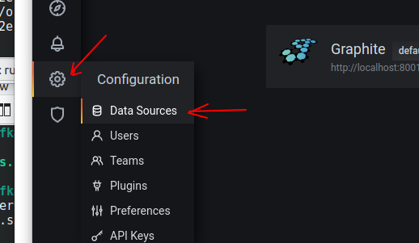
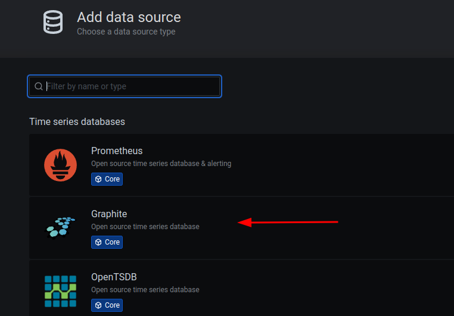
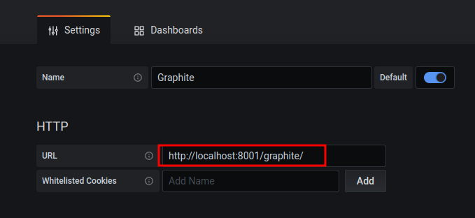

<link rel='stylesheet' href='../assets/css/main.css'/>

[<< back to main index](../README.md)

# Lab 9.2: Metrics - intro

## Overview

Learn Metrics library, Graphite, Grafana

## Depends On

## Run time

20 mins

**Instructor: Demo this lab**

## Step 1: Access Grafana

Bring up Grafana UI on the lab VM.

username : admin

password : will be provided (the same password as jupyter)

## Step 2: Add Graphite Datasource

Follow the screenshots below to add Graphite data source

Make sure the Graphite url is **http://localhost:8001/graphite/**

**Save the datasource and make sure it works fine**

## Step 3: Import Grafana Dashboard

**Go to Dashboard --> Manage**

**Click Import**

**Choose Upload JSON file**

**Select the following JSON file**

file: `kafka-labs/src/main/java/x/lab09_metrics/kafka-metrics-dashboard.json`

**Make sure Dashboard is imported**

## Step 4: Inspect `ConsumerWithMetrics`

file : `src/main/java/x/lab09_metrics/ConsumerWithMetrics.java`

**Inspect metrics usage**

**Run this file in Eclipse**

## Step 5: Inspect `ProducerWithMetrics`

file : `src/main/java/x/lab09_metrics/ProducerWithMetrics.java`

**Inspect metrics usage**

**Run this file in Eclipse**

## Step 6: Inspect Grafana Dashboard

**Enjoy the shiny metrics**

## Step 7: Add a New Metrics Panel

**Click on the `PLUS` sign on top to create a new panel**

**Then add a metric (can be a duplicate one) from scratch, so you understand the process**